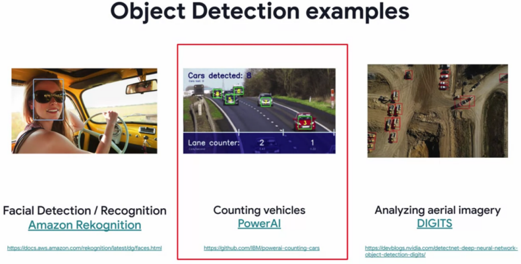
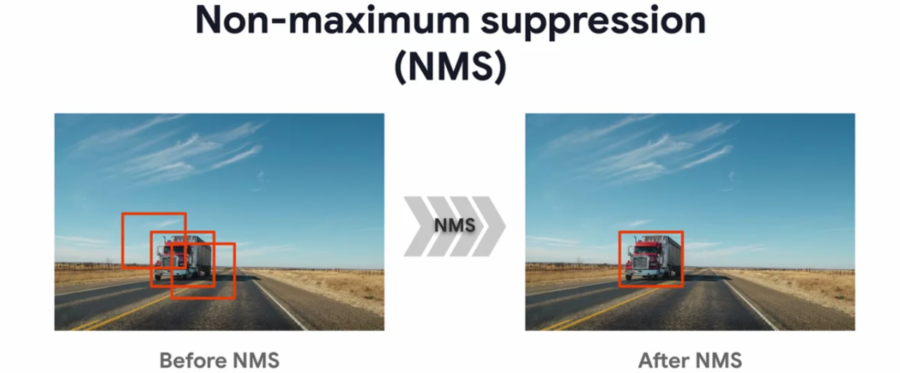

# Week 2: *Object detection.*
***

#### There are multiple applications of object detection.

#### They include:
- Facial detection or recognition.
- Counting vehicles on a road from a video stream and
- Analyzing aerial imagery.

The first object detection technique is known as `sliding window mechanism`
- This technique involves passing a bounding box around an image and classifying contents within the bounding box.
- At each position of the sliding window, the model classifies what it has seen within the boundaries of the rectangle. 

- Because of the position of the sliding window, we can also infer about the object's location within the image.

- In the end, we will have multiple boxes detecting the same object in the image. We use `Non-maximum suppression` to get the box with the largest `Intersection over Union (IoU)` 

- `IoU` is a metric that calculates how close a bounding box is to the true label of an object in the image.
### Steps for object detection. 

#### 1. Region proposals.
#### 2. Object detection and classification.